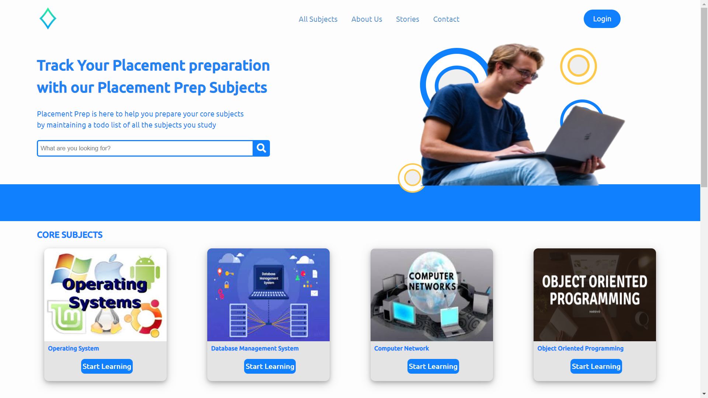
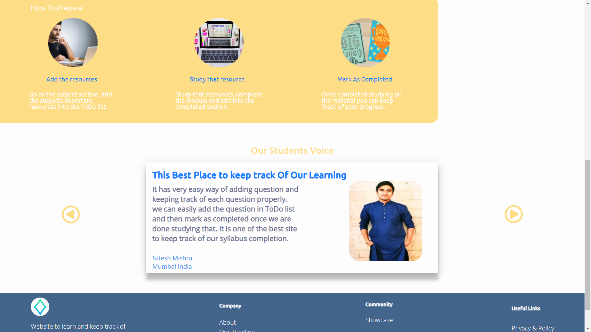
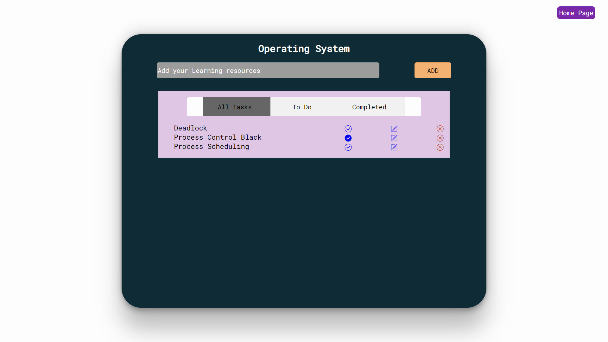
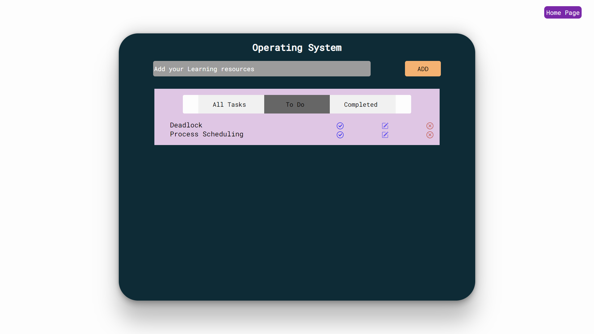
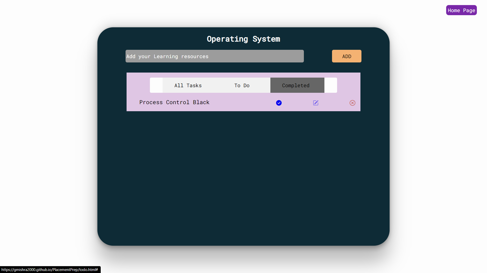

# PlacementPrep
This is a personal site where you can keep track of your core subjects preparation  for placements in a ToDo List manner. 

<h4>You can visit the site over Here</h4>

https://gmishra2000.github.io/PlacementPrep/index.html

<h3> Frontend Built using  only HTML , CSS, Javascript<h3>
  <h3> Used Local Storage web API to store the data in browser</h3>

<h1>HOME PAGE</h1>

<h1>ABOUT PAGE</h1>

<h2> Click on <strong>Start learning</strong> of  Core subjects and then move to TO DO page to Add your task and make use of tracking your progress</h2>

